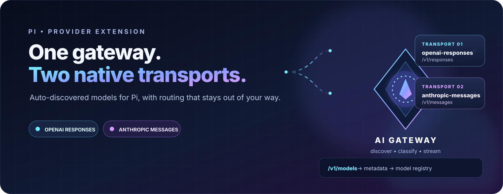
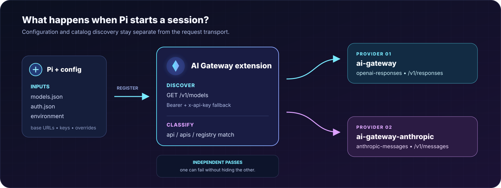

<div align="center">



# pi-extension-ai-gateway

**Connect [Pi](https://pi.dev) to an AI gateway with model autodiscovery, native transport routing, and zero changes to Pi’s built-in providers.**

<p>
  <a href="https://github.com/tumido/pi-extension-ai-gateway/blob/main/LICENSE"></a>
  <a href="https://github.com/tumido/pi-extension-ai-gateway"></a>
  <a href="https://www.typescriptlang.org/"></a>
</p>

<p><sub>One <code>providers.ai-gateway</code> entry. Two provider IDs. A catalog that keeps up with your gateway.</sub></p>

</div>

## Start here

### 1. Install

```bash
pi install git:https://github.com/tumido/pi-extension-ai-gateway
```

### 2. Choose one credential path

Choose one credential source. The same key can authenticate both supported transports.

Environment variable:

```bash
export AI_GATEWAY_API_KEY="sk-your-gateway-key"
```

Or store it in Pi’s `auth.json`:

```json
{
  "ai-gateway": {
    "type": "api_key",
    "key": "sk-your-gateway-key"
  }
}
```

You can also put `apiKey` directly in the `models.json` entry from the next step. You do not need both `auth.json` and `models.json` `apiKey`; `auth.json` is used first when both are present.

### 3. Configure one gateway entry

Add this to `models.json`:

```json
{
  "providers": {
    "ai-gateway": {
      "baseUrl": "https://gateway.example/unified",
      "apiKey": "$AI_GATEWAY_API_KEY"
    }
  }
}
```

In this example, `apiKey` is a reference to the environment variable. If you use `auth.json` instead, omit the `apiKey` line. If you use a literal key or another resolvable environment variable in `models.json`, `auth.json` is not required.

### 4. Start Pi

On the first run, the extension discovers models while registering the providers, before the session starts. After Pi has cached a catalog, startup uses that local cache and the live catalog is refreshed when the session starts. A model is then available under the provider that matches its transport.

Pi normally reads `models.json` and `auth.json` from `~/.pi/agent/`. Set `PI_CODING_AGENT_DIR` when your Pi configuration lives elsewhere.

## One credential, two native transports

The extension registers two provider IDs from the single `providers.ai-gateway` configuration:

| Provider ID | Supported Pi transport | Request route | Authentication sent |
| --- | --- | --- | --- |
| `ai-gateway` | `openai-responses` | `/v1/responses` | `Authorization: Bearer <key>` first; retries with `x-api-key` when needed |
| `ai-gateway-anthropic` | `anthropic-messages` | `/v1/messages` | `x-api-key: <key>` first; retries with both headers when needed |

The key is not used to randomly load-balance requests. Instead, the extension distributes a model to the appropriate provider based on its declared `api`/`apis`, an exact Pi registry match, or a conservative Claude-ID rule. Pi then calls the native transport for the provider the model belongs to.

```text
one key + one gateway config
          │
          ├── discover with Bearer ──► ai-gateway
          │                             └─ openai-responses → /v1/responses
          │
          └── discover with x-api-key ► ai-gateway-anthropic
                                        └─ anthropic-messages → /v1/messages
```

During streaming, the selected request receives both standard gateway credential headers when a key is available, so gateways that inspect either convention can authenticate the call. If the Anthropic side needs a different secret, add a separate `ai-gateway-anthropic` credential; otherwise it falls back to `ai-gateway` automatically.

## What this extension supports

### OpenAI Responses

- Provider ID: `ai-gateway`
- Pi API: `openai-responses`
- Catalog: `GET <host-root>/v1/models` or `GET <versioned-base>/models`
- Requests: `<host-root>/v1/responses`
- Primary discovery header: `Authorization: Bearer ...`

### Anthropic Messages

- Provider ID: `ai-gateway-anthropic`
- Pi API: `anthropic-messages`
- Catalog: `GET <host-root>/v1/models` or `GET <versioned-base>/models`
- Requests: `<host-root>/v1/messages`
- Primary discovery header: `x-api-key: ...`

These are the two transports implemented by the extension. The underlying gateway must expose the catalog and request routes for whichever transport you enable.

## How it fits together

<p align="center">
  
</p>

Both discovery passes run independently. A gateway can advertise different catalogs—or temporarily fail on one front door—without taking the other provider down.

## Endpoint configuration

`baseUrl` is the shared fallback. Use transport-specific front doors when the OpenAI-compatible and Anthropic-compatible routes live at different URLs:

```json
{
  "providers": {
    "ai-gateway": {
      "baseUrl": "https://gateway.example/unified",
      "openaiBaseUrl": "https://gateway.example/openai/v1",
      "anthropicBaseUrl": "https://gateway.example/anthropic",
      "apiKey": "$PRICETAG_KEY"
    }
  }
}
```

| Transport | Catalog discovery | Request route | Base URL convention |
| --- | --- | --- | --- |
| OpenAI Responses | `<openaiBaseUrl>/models` when the URL ends in `/v1` | `<openaiBaseUrl>/responses` | Keep `/v1` in the model base URL. |
| Anthropic Messages | `<anthropicBaseUrl>/v1/models` when using a host root | `<anthropicBaseUrl>/v1/messages` | Use the host root; Pi’s Anthropic adapter appends `/v1/messages`. |

When a configured URL does not end in `/v1`, discovery tries `<baseUrl>/v1/models` first and then `<baseUrl>/models` as a fallback. A URL that already ends in `/v1` is queried directly.

## Model discovery and routing

### Live catalogs plus explicit models

Autodiscovery can only expose IDs returned by the selected catalog. Add models manually when a gateway supports a model but omits it from `/v1/models`:

```json
{
  "providers": {
    "ai-gateway": {
      "baseUrl": "https://gateway.example/v1",
      "apiKey": "$AI_GATEWAY_API_KEY",
      "models": [
        { "id": "gpt-5", "api": "openai-responses" },
        { "id": "gpt-5.4", "api": "openai-responses" },
        { "id": "claude-sonnet-5", "api": "anthropic-messages" }
      ]
    }
  }
}
```

Explicit entries are merged with the live catalog. A gateway catalog entry can provide its own metadata; an exact model-ID match in Pi’s registry fills fields that are missing. The gateway still needs to accept the model ID at the selected request route—an explicit entry only makes it selectable.

### Choose one or both transports

The standard per-model `api` selector is supported:

```json
{ "id": "openai-only-model", "api": "openai-responses" }
```

For a model that is valid on both transports, omit `api`, or use an explicit allowlist:

```json
{
  "id": "shared-model",
  "apis": ["openai-responses", "anthropic-messages"]
}
```

The default rules are intentionally conservative:

- Claude IDs are kept on `anthropic-messages` unless you explicitly choose another API.
- Exact Pi registry matches keep their native transport when the registry provides one.
- Models without a transport hint are exposed through both providers.
- IDs that look like embeddings, moderation, speech, transcription, image, or realtime models are filtered out. Set `PI_AI_GATEWAY_INCLUDE_NON_CHAT_MODELS=1` to include them.

### Correct incomplete metadata with Pi overrides

If your gateway’s limits differ from Pi’s registry, use Pi’s normal `modelOverrides` support. For example:

```json
{
  "providers": {
    "ai-gateway": {
      "baseUrl": "https://gateway.example/v1",
      "apiKey": "$AI_GATEWAY_API_KEY",
      "modelOverrides": {
        "gpt-5": {
          "contextWindow": 400000,
          "maxTokens": 128000,
          "reasoning": true,
          "thinkingLevelMap": {
            "off": null,
            "low": "low",
            "medium": "medium",
            "high": "high"
          }
        }
      }
    }
  }
}
```

## Authentication details

Choose one of these credential sources:

- A Pi `auth.json` credential for the provider.
- `apiKey` in `models.json`, either as a literal value or an `$ENV_VAR` reference.
- `AI_GATEWAY_API_KEY` as the environment fallback.

You only need one source. If more than one is configured, the effective precedence is `auth.json`, then `models.json` `apiKey`, then `AI_GATEWAY_API_KEY`. Configuring only `baseUrl` in `models.json` does not provide a key for live discovery.

The Anthropic provider reuses the `ai-gateway` credential when its own credential is absent. Supply a separate `ai-gateway-anthropic` entry when the two front doors need different keys. Existing `openai` and `anthropic` credentials remain independent.

`models.json` accepts any environment-variable name—`$PRICETAG_KEY`, `$TEAM_GATEWAY_KEY`, or `$AI_GATEWAY_API_KEY` all work:

```json
{
  "providers": {
    "ai-gateway": {
      "baseUrl": "https://gateway.example/v1",
      "apiKey": "$TEAM_GATEWAY_KEY"
    }
  }
}
```

## Environment variables

| Variable | Purpose | Precedence |
| --- | --- | --- |
| `PI_AI_GATEWAY_OPENAI_BASE_URL` or `AI_GATEWAY_OPENAI_BASE_URL` | OpenAI Responses endpoint | Highest URL override |
| `PI_AI_GATEWAY_ANTHROPIC_BASE_URL` or `AI_GATEWAY_ANTHROPIC_BASE_URL` | Anthropic Messages endpoint | Highest URL override |
| `PI_AI_GATEWAY_BASE_URL` or `AI_GATEWAY_BASE_URL` | Shared endpoint fallback | Before `models.json` |
| `AI_GATEWAY_API_KEY` | Key fallback | After `auth.json` and `models.json` |
| `PI_AI_GATEWAY_INCLUDE_NON_CHAT_MODELS=1` | Include obviously non-chat catalog IDs | Filter override |
| `PI_OFFLINE=1` | Skip network discovery | Offline mode |

Transport-specific URL variables win over the shared URL. Within each pair, the `PI_...` spelling is checked first.

## Troubleshooting

### No models appear

Check the catalog URL and key first. The extension needs a successful `GET /v1/models` (or the fallback `/models`) before it can discover anything. Explicit `models` entries still work when network discovery is unavailable.

### GPT models are missing

The extension cannot invent an ID that the gateway does not advertise. Add the model explicitly and select `openai-responses` if the gateway accepts it on `/v1/responses`.

### A Claude model appears only under the Anthropic provider

That is the safe default. Claude IDs are routed to `anthropic-messages` because an OpenAI-compatible gateway often does not accept them on `/v1/responses`. Add `"api": "openai-responses"` only when your gateway genuinely supports that route.

### The endpoint path looks almost right, but requests fail

Keep the URL roles distinct:

- OpenAI Responses models use a base ending in `/v1`.
- Anthropic Messages models use the host root; Pi’s adapter appends `/v1/messages`.
- Both transports discover from `<host-root>/v1/models` unless the configured URL already ends in `/v1`.

### Discovery is slow or flaky

On a first run, the two catalogs are fetched independently during provider initialization, with a 10-second timeout per catalog. Once cached, startup does not wait for the gateway; the catalogs are refreshed when the session starts. A failed catalog is logged and Pi keeps the last published catalog.

## Local development

Load the extension directly from a checkout without changing Pi’s settings:

```bash
pi -e ./extensions/ai-gateway-provider.ts --list-models
```

For project-local development, register the checkout:

```bash
pi install . --local
```

There is no generated build artifact in this repository; the extension is the TypeScript file at [`extensions/ai-gateway-provider.ts`](./extensions/ai-gateway-provider.ts).

## License

[MIT](./LICENSE)
